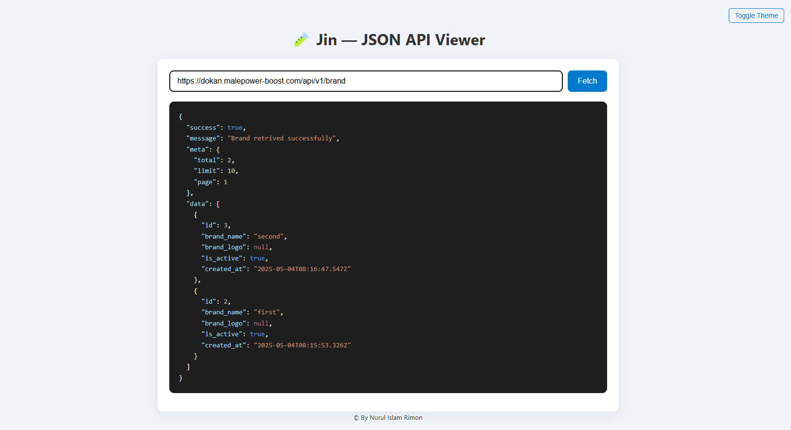

# 🧪 Jin — JSON Inspector

**Jin** _(short for JSON Inspector)_ is a lightweight, browser-based JSON API viewer — designed to be the **simplest way** to inspect, debug, and beautify JSON responses from any public API. Think of it as your minimal, no-install version of Postman, just focused on clean JSON visualization.

---

## ✨ Features

- 🔎 Dynamic input for any API URL
- 🎨 Beautiful syntax-highlighted JSON output
- ⚡ Lightweight and blazing fast (zero dependencies)
- 😍 Clean, modern UI with responsive layout
- ❌ Graceful error handling for invalid or broken endpoints

---

## 📸 Preview



---

## 🚀 Getting Started

### 1. Clone the project

```bash
git clone https://github.com/nurulislamrimon/Jin.git
cd jin
```

## Developed by Nurul Islam Rimon
